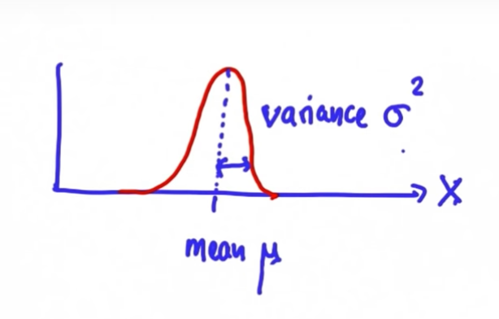
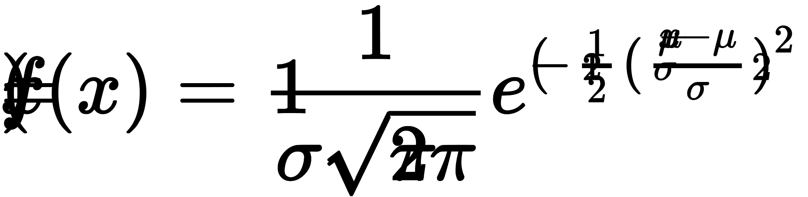
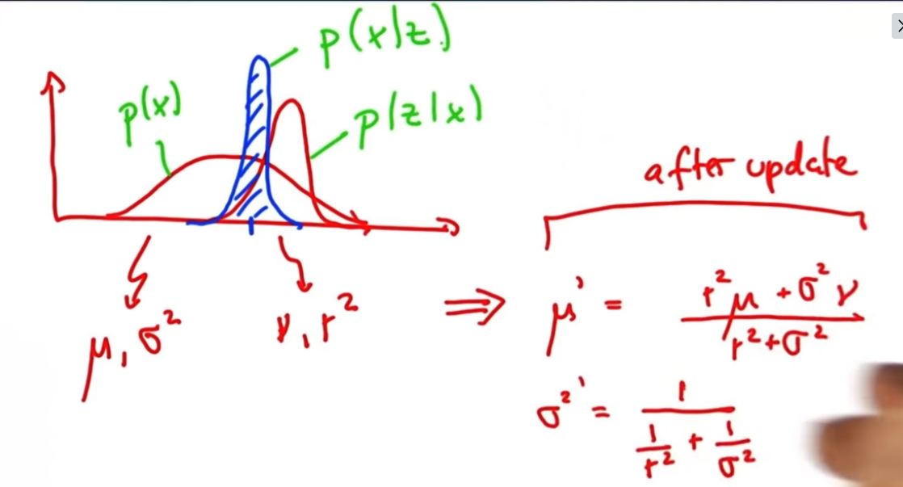
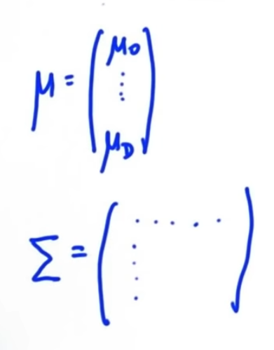
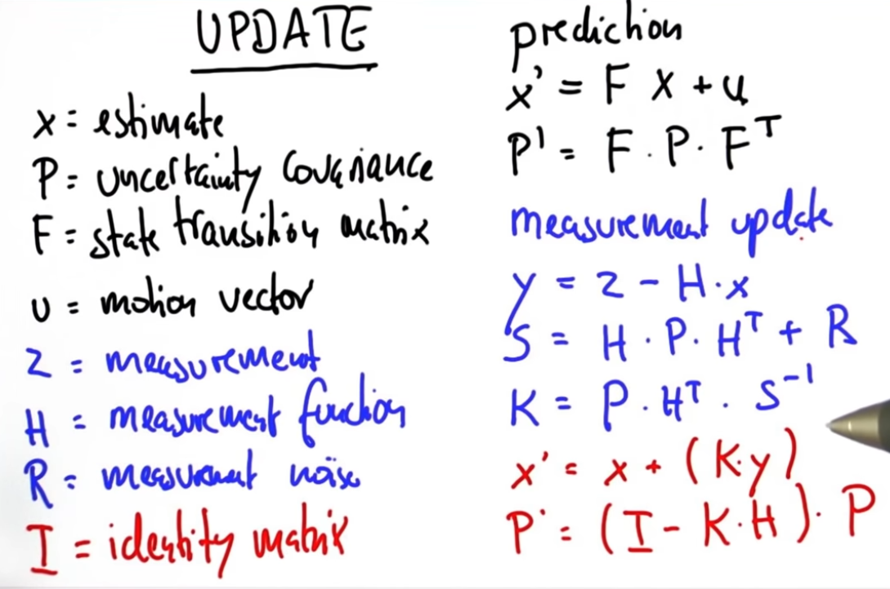

# Lesson 2: Kalman filter (Tracking)

* Continuous
* uni-modal = We can only have one probability peak (Gausian model)

## Gaussian distribution:



Our task in kalman filter is to maintain mu and sigma that is our best estimate of a localization
```text
μ = mu = Height of the gaussian = Mean of the distribution 
σ^2 = sigma = Width of the gaussian = Variance of the distribution

The formula where x is the position in question:
f(x) = exp^(-(1/2)*((x-μ)^2/σ^2)

So if x is equal μ will gives us exp^0=1 which means that we are 100% sure that x is where we are.
We have to normalize this by a constant "1/(sqrt(2*pi*σ^2)" so we expand the formula:
f(x) =  1/(sqrt(2*pi*σ^2) * exp^(-(1/2)*((x-μ)^2/σ^2)

```
Gaussian formular formatted:




**Updating the gaussian belief:**
```text
mu , sigma2  = prior belief     = P(X)
v  , r2      = new measurements = P(Z|X)
mu', sigma2' = new belief       = P(X|Z)

mu'     = (r2 * mu + sigma2 * v) / (sigma2 + r2)
sigma2' = 1 / ((1 / r2) + (1 / sigma2))


```


This is exactly what we programmed in 2_location_robot_example.py in the method sense and see cancer example

## High dimensional (Multivariate) Gaussian:

```text
Now the mu is a vector of "n" mu's (means) in a n dimensional space. 
     |mu_1 |
mu = |...  |
     |mu_n |
     
The variance^2 is replaced by what's called a co-variance and it's a matrix with D rows and D columns
```

https://classroom.udacity.com/courses/cs373/lessons/48723604/concepts/486836600923



```text
Predict next state:
new_state_x = F * x + u
new_covariance_P = F * P * F^Transposed

Measurements update:
error_y = Z_measurement - H * x
# The error is mapped into a matrix S, which is obtained by projecting the system uncertainty
S = H * P * H^Transposed + R_measurement_noise
# This is then mapped into K, which is often called Kalman gain
K = P * H^Transposed * S^Inverted 
new_state_x = x + (K * error_y)
new_covariance_P = (I - K * H) * P
```